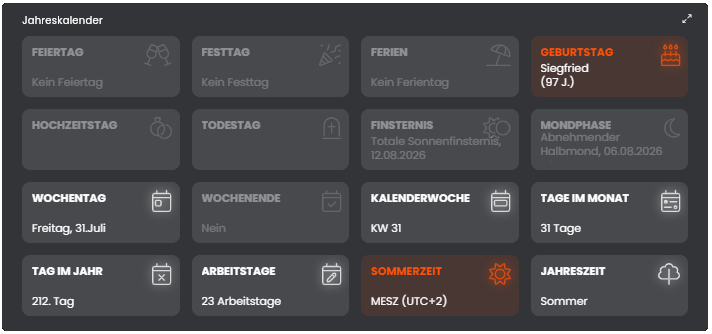

# 📆 Jahreskalender (Almanac)

[](https://wilkware.de/module/almanac/)
[](https://www.symcon.de/service/dokumentation/entwicklerbereich/sdk-tools/sdk-php/)
[](https://www.symcon.de/produkt/)
[](https://github.com/Wilkware/Almanac)
[](https://creativecommons.org/licenses/by-nc-sa/4.0/)
[](https://github.com/Wilkware/Almanac/actions)

Dieses Modul bietet jährliche Kalenderinformationen wie Feiertage, Schulferien und Festtage.  
Außerdem werden Informationen wie Arbeitstage im Monat, Schaltjahr, Jahreszeit oder ob Wochenende ist aktuell gehalten.  
Darüber hinaus kann man Geburtstage, Hochzeitstage und Todestage verwalten und sich täglich informieren lassen.  
Auch verschiedene astronomische Daten wie Mond- und Sonnenfinsternis oder die Daten der Mondphasen (Neumond, zunehmenden Mond, Vollmond und abnehmenden Mond) werden bereitgestellt.  
Ein Zitat des Tages rundet die Funktionalität des Modules ab.



## Inhaltsverzeichnis

1. [Funktionsumfang](#user-content-1-funktionsumfang)
2. [Voraussetzungen](#user-content-2-voraussetzungen)
3. [Installation](#user-content-3-installation)
4. [Einrichtung](#user-content-4-einrichtung)
5. [Statusvariablen](#user-content-5-statusvariablen)
6. [Darstellungen](#user-content-6-darstellungen)
7. [Visualisierung](#user-content-7-visualisierung)
8. [Befehlsreferenz](#user-content-8-befehlsreferenz)
9. [Versionshistorie](#user-content-9-versionshistorie)

### 1. Funktionsumfang

Das Modul nutzt eine eigens entwickelte JSON-API (CDN basierend) um die Daten für Feiertage und Schulferien
in Deutschland, Österreich, der Schweiz und Kroatien bereitzustellen.  
Derzeit unterstützt das Modul auch eine Vielzahl verschiedenster religiöser und weltlicher Festtage (z.B. Valentinstag oder Kindertag).  
Als Gedächtnisstütze können die jährlichen Geburtstage, Hochzeitstage aber auch Todestage verwaltet werden und man
kann sich täglich informieren lassen ob ein Termin ansteht (Meldungsverwaltung oder via Visualisierung-Notification).  
Darüber hinaus werden mittels der PHP Funktion "date" verschiedene Informationen für das aktuelle Datum ermittelt.  
In Kombination mit den ermittelten Feiertagen werden auch die Arbeitstage im aktuellen Monat bereitgestellt.  
Spezielle astronomische Ereignisse wie Mond- oder Sonnenfinsternis und das Datum der 4 verschiedenen Mondphasen für das nächste Datum wird ermittelt.
Aber auch ein "Zitat des Tages" kann abgerufen werden.

Folgende Informationen werden ermittelt:

* Sind Ferien und welche
* Feiertag oder nicht und wie heißt er
* Festtag oder nicht und wie heißt er
* Hat jemand Geburtstag, Hochzeitstag oder Todestag
* Der Tag des Jahres
* Anzahl Tage im Monat
* Arbeitstage im Monat
* Schaltjahr oder nicht
* Sommerzeit oder nicht
* Wochenende oder nicht
* Nummer der Kalenderwoche
* Wochentag (ISO-8601)
* Jahreszeit (Frühling, Sommer, Herbst und Winter)
* Ist eine Mond- oder Sonnenfinsternis
* Tritt eine Mondphasen (Neumond, zunehmenden Mond, Vollmond oder abnehmenden Mond) ein
* Zitat des Tages (Spruch und Autor)

All diese Information können auch über die Methode [ALMANAC_DateInfo](#user-content-8-befehlsreferenz) als JSON abgeholt werden.

Folgende Informationen stehen als key => value Paare zur Verfügung:

Index                 | Typ     | Beschreibung
--------------------- | ------- | ----------------
IsSummer              | bool    | TRUE, wenn Sommerzeit ist
IsLeapYear            | bool    | TRUE, wenn Schaltjahr ist
IsWeekend             | bool    | TRUE, wenn Wochenende ist (SA-SO)
Weekday               | int     | Wochentag (1=Montag ... 7=Sonntag)
WeekNumber            | int     | Kalenderwochennummer
DaysInMonth           | int     | Anzahl Tage im Monat
DayOfYear             | int     | Tag im Jahr (1-366)
DayLong               | string  | Tagesdatum (langes Format, z.B.: Montag, 1.Januar 1970)
Season                | string  | Name der Jahreszeit ("Spring", "Summer", "Fall" oder "Winter")
Festive               | string  | Name des Festtags, oder "Kein Festtag"
IsFestive             | bool    | TRUE, wenn Festtag ist
WorkingDays           | int     | Arbeitstage im Monat
Holiday               | string  | Name des Feiertags, oder "Kein Feiertag"
IsHoliday             | bool    | TRUE, wenn Feiertag ist
Vacation              | string  | Name der Schulferien, oder "Keine Ferien"
IsVacation            | bool    | TRUE, wenn Schulferienzeit ist
IsBirthday            | bool    | TRUE, wenn Geburtstag(e) ansteht
Birthday              | array   | LEER, oder Feld mit Datum, Jahrestag und Name
IsWeddingday          | bool    | TRUE, wenn Hochzeitstag(e) ansteht
Weddingday            | array   | LEER, oder Feld mit Datum, Jahrestag und Name
IsDeathday            | bool    | TRUE, wenn Todestag(e) ansteht
Deathday              | array   | LEER, oder Feld mit Datum, Jahrestag und Name
IsEclipse             | bool    | TRUE, wenn Mond- oder Sonnenfinsternis ist
Eclipse               | array   | Feld mit Name, Datum, Uhrzeit des nächsten Ereignisses (LEER, wenn im aktuellen Jahr kein Ereignis mehr ist)
IsMoonphase           | bool    | TRUE, wenn Mondphase ist
Moonphase             | array   | Feld mit Name, Datum, Uhrzeit des nächsten Ereignisses (LEER, wenn im aktuellen Jahr kein Ereignis mehr ist)
QuoteOfTheDay         | array   | Zitat und Autor

### 2. Voraussetzungen

* Symcon ab Version 8.1

### 3. Installation

* Über den Modul Store das Modul _Almanach_ installieren.
* Alternativ über das Modul Control folgende URL hinzufügen.  
`https://github.com/Wilkware/Almanac` oder `git://github.com/Wilkware/Almanac.git`

### 4. Einrichtung

* Unter 'Instanz hinzufügen' ist das _Almanach_-Modul (Alias: _Jahreskalender_) unter dem Hersteller '(Sonstige)' aufgeführt.

__Konfigurationsseite__:

Einstellungsbereich:

> 🏖️ Feiertage ...

Name                                | Beschreibung
------------------------------------|----------------------------------
Land                                | Auswahl des Landes (Deutschland, Österreich, Schweiz und Kroatien).
Bundesland                          | Auswahl des Bundeslandes/Kantons für welchen man die Feiertage ermittelt haben möchte.

> ✈️ Schulferien ...

Name                                | Beschreibung
------------------------------------|----------------------------------
Land                                | Auswahl des Landes (Deutschland, Österreich, Schweiz und Kroatien).
Bundesland                          | Auswahl des Bundeslandes/Kantons für welchen man die Schulferien ermittelt haben möchte.
Schulen                             | Derzeit nur für die Schweiz entscheidend, Auswahl der gewünschten Schule im Kanton.

> 🎂 Geburtstage ...

Name                                | Beschreibung
------------------------------------|---------------------------------
Termine                             | Eingabe des Geburtstermins (Tag.Monat.Jahr) und den dazugehörigen Namen
Nachricht an Visualisierung senden  | Auswahl ob Push-Nachricht gesendet werden soll oder nicht (Ja/Nein)
Nachricht Sendezeit                 | Uhrzeit wann täglich die Nachricht gesendet werden soll
Meldung an Anzeige senden           | Auswahl ob Eintrag in die Meldungsverwaltung erfolgen soll oder nicht (Ja/Nein)
Lebensdauer der Nachricht           | Wie lange soll die Meldung angezeigt werden?
Format der Textmitteilung           | Frei wählbares Format der zu sendenden Nachricht/Meldung
Text in Variable schreiben          | Auswahl ob Nachricht in Variable geschrieben werden soll
Texttrennzeichen/Zeilenumbruch      | Trennzeichen bei mehreren Ereignissen

> 💍 Hochzeitstage ...

Name                                | Beschreibung
------------------------------------|---------------------------------
Termine                             | Eingabe Heiratstermins (Tag.Monat.Jahr) und den dazugehörigen Namen
Nachricht an Visualisierung senden  | Auswahl ob Push-Nachricht gesendet werden soll oder nicht (Ja/Nein)
Nachricht Sendezeit                 | Uhrzeit wann täglich die Nachricht gesendet werden soll
Meldung an Anzeige senden           | Auswahl ob Eintrag in die Meldungsverwaltung erfolgen soll oder nicht (Ja/Nein)
Lebensdauer der Nachricht           | Wie lange soll die Meldung angezeigt werden?
Format der Textmitteilung           | Frei wählbares Format der zu sendenden Nachricht/Meldung
Text in Variable schreiben          | Auswahl ob Nachricht in Variable geschrieben werden soll
Texttrennzeichen/Zeilenumbruch      | Trennzeichen bei mehreren Ereignissen

> 🪦 Todestage ...

Name                                | Beschreibung
------------------------------------|---------------------------------
Termine                             | Eingabe Sterbetag (Tag.Monat.Jahr) und den dazugehörigen Namen
Nachricht an Visualisierung senden  | Auswahl ob Push-Nachricht gesendet werden soll oder nicht (Ja/Nein)
Nachricht Sendezeit                 | Uhrzeit wann täglich die Nachricht gesendet werden soll
Meldung an Anzeige senden           | Auswahl ob Eintrag in die Meldungsverwaltung erfolgen soll oder nicht (Ja/Nein)
Lebensdauer der Nachricht           | Wie lange soll die Meldung angezeigt werden?
Format der Textmitteilung           | Frei wählbares Format der zu sendenden Nachricht/Meldung
Text in Variable schreiben          | Auswahl ob Nachricht in Variable geschrieben werden soll
Texttrennzeichen/Zeilenumbruch      | Trennzeichen bei mehreren Ereignissen

> 🔭 Verschiedenes ...

Name                                                   | Beschreibung
-------------------------------------------------------|------------------------------------------------
Textausgabeformat für Mond- und Sonnenfinsternisse     | Frei wählbares Format für die Ereignisausgabe
Textausgabeformat für Mondphasen                       | Frei wählbares Format für die Ereignisausgabe
Textausgabeformat für Zitat des Tages                  | Frei wählbares Format für die Zitatsausgabe
Textausgabeformat für langes Tagesformat               | Frei wählbares Format für das Tagesdatum

> ✨ Visualisierung ...

Name                                      | Beschreibung
------------------------------------------|------------------------------------------------
Rechner/Großer Bildschirm (≥1024px)       | Spaltenanzahl (1-6) innerhalb der Kachel für Desktop
Tablet/Mittelgroßer Bildschirm (≥600px)   | Spaltenanzahl (1-4) innerhalb der Kachel für Tablets
Mobiltelefon/Kleiner Bildschirm (<600px)  | Spaltenanzahl (1-2) innerhalb der Kachel für Handys
Komplikationen (Tabelle)                  | Definition der Reihenfolge, zu verwendendes Icon, Platzbedarf und Sichtbarkeit je Gerät

> ⚙️ Erweiterte Einstellungen ...

Name                                      | Beschreibung
------------------------------------------|----------------------------------
Feiertage ermitteln                       | Status, ob Ermittlung der Feiertage erwünscht ist
Schulferien ermitteln                     | Status, ob Ermittlung der Schulferien erwünscht ist
Festtage ermitteln                        | Status, ob Ermittlung der Festtage erwünscht ist
Geburtstage ermitteln                     | Status, ob Geburtstage ausgewertet werden sollen
Hochzeitstage ermitteln                   | Status, ob Hochzeitstage ausgewertet werden sollen
Todestage ermitteln                       | Status, ob Todesstage ausgewertet werden sollen
Finsternisse ermitteln                    | Status, ob Ermittlung von Mond- oder Sonnenfinsternisse erwünscht ist
Mondphasen ermitteln                      | Status, ob Ermittlung von Mondphasen erwünscht ist
Zitat des Tages ermitteln                 | Status, ob Zitat des Tages ausgegeben werden soll
Information zum aktuellen Datum ermitteln | Status, ob Informationen zum aktuellen Datum erwünscht sind.
Feiertage                                 | Text, welcher ausgeben wird wenn kein Feiertag vorliegt.
Schulferien                               | Text, welcher ausgeben wird wenn keine Ferien vorliegt.
Festtage                                  | Text, welcher ausgeben wird wenn kein Festtag vorliegt.
Geburtstage                               | Text, welcher ausgeben wird wenn kein Geburtstag vorliegt.
Hochzeitstage                             | Text, welcher ausgeben wird wenn kein Hochzeitstag vorliegt.
Todestage                                 | Text, welcher ausgeben wird wenn kein Todestag vorliegt.
Visualisierungs-Instanz                   | ID der Visualisierung, an welches die Push-Nachrichten für Geburts-, Hochzeits- und Todestage gesendet werden soll
Meldungsskript                            | Skript ID des Meldungsverwaltungsskripts, weiterführende Infos im Forum: [Meldungsanzeige im Webfront](https://community.symcon.de/t/meldungsanzeige-im-webfront/23473)

Aktionsbereich:

> ♾️ Import & Export von ...

Aktion         | Beschreibung
---------------|-------------------------------------------------------------
GEBURTSTAGE    | Öffnet Popup für die Möglichkeit zum Import/Export/Leeren der Geburtstagsliste als CSV Datei (geburtstage.csv)
HOCHZEITSTAGE  | Öffnet Popup für die Möglichkeit zum Import/Export/Leeren der Hochzeitsliste als CSV Datei (hochzeitstage.csv)
TODESTAGE      | Öffnet Popup für die Möglichkeit zum Import/Export/Leeren der Sterbeliste als CSV Datei (todestage.csv)

_Hinweis:_ CSV-Format ist Termin, Name => 1.1.1970,"Herr Max Mustermann"

> 💡 Tagesdaten ...

Aktion         | Beschreibung
---------------|-------------------------------------------------------------
AKTUALISIEREN  | Ermittelt für das aktuelle Datum alle Informationen (Update)

### 5. Statusvariablen

Die Statusvariablen werden automatisch angelegt, sofern die jeweilige Ermittlung unter 'Erweiterte Einstellungen' aktiviert ist.  
Die Variablen für Geburts-, Hochzeits- und Todestage werden zusätzlich nur angelegt, wenn 'Text in Variable schreiben' aktiviert ist.  
Das Löschen einzelner Variablen kann zu Fehlfunktionen führen.

Ident             | Name                             | Typ     | Beschreibung
----------------- | -------------------------------- | ------- | ------------------------------
IsHoliday         | Ist Feiertag?                    | Boolean | Ist aktueller Tag ein Feiertag?
IsVacation        | Ist Ferienzeit?                  | Boolean | Fällt aktueller Tag in die Ferien?
IsFestive         | Ist Festtag?                     | Boolean | Ist aktueller Tag ein Festtag?
IsBirthday        | Ist Geburtstag?                  | Boolean | Ist am aktuellen Tag ein Geburtstag?
IsWeddingday      | Ist Hochzeitstag?                | Boolean | Ist am aktuellen Tag ein Hochzeitstag?
IsDeathday        | Ist Todestag?                    | Boolean | Ist am aktuellen Tag ein Todestag?
IsEclipse         | Ist Mond- oder Sonnenfinsternis? | Boolean | Ist am aktuellen Tag eine Mond- oder Sonnenfinsternis?
IsMoonphase       | Ist Mondphase?                   | Boolean | Tritt am aktuellen Tag eine Mondphase ein?
IsSummer          | Ist Sommerzeit?                  | Boolean | Ist aktuell Sommerzeit aktiv?
IsLeapyear        | Ist Schaltjahr?                  | Boolean | Ist aktuelles Jahr ein Schaltjahr?
IsWeekend         | Ist Wochenende?                  | Boolean | Ist gerade Wochenende?
Holiday           | Feiertag                         | String  | Name des Feiertages oder 'Kein Feiertag'
Vacation          | Ferien                           | String  | Name der Schulferien oder 'Keine Ferien'
Festive           | Festtag                          | String  | Name des Festtages oder 'Kein Festtag'
Birthday          | Geburtstag                       | String  | Formatierte Ausgabe des Geburtstages oder 'Kein Geburtstag'
Weddingday        | Hochzeitstag                     | String  | Formatierte Ausgabe des Hochzeitstages oder 'Kein Hochzeitstag'
Deathday          | Todestag                         | String  | Formatierte Ausgabe des Todestages oder 'Kein Todestag'
Eclipse           | Mond- oder Sonnenfinsternis      | String  | Formatierte Ausgabe der nächsten Mond- oder Sonnenfinsternis
Moonphase         | Mondphase                        | String  | Formatierte Ausgabe der nächsten Mondphase
WeekDay           | Wochentag                        | Integer | Aktueller Wochentag (ISO-8601)
WeekNumber        | Kalenderwoche                    | Integer | Nummer der aktuellen Kalenderwoche
DaysInMonth       | Tage im Monat                    | Integer | Wieviel Tage hat der aktuelle Monat?
DayOfYear         | Tag im Jahr                      | Integer | Welcher Tag des Jahres?
DayLong           | Tagesformat                      | String  | Formatiertes Datum (lang)
WorkingDays       | Arbeitstage im Monat             | Integer | Anzahl der Arbeitstage im aktuellen Monat
Season            | Jahreszeit                       | String  | Aktuelle Jahreszeit
QuoteOfTheDay     | Zitat des Tages                  | String  | Formatierte Ausgabe des Zitats des Tages

### 6. Darstellungen

Die Darstellungen werden direkt an den Statusvariablen hinterlegt, es werden keine Profile angelegt.

Variable                         | Darstellung   | Werte
-------------------------------- | ------------- | ------------------------------
Alle 'Ist ...?'-Variablen        | Wertanzeige   | Nein (false), Ja (true)
Wochentag                        | Wertanzeige   | Montag (1) ... Sonntag (7)
Jahreszeit                       | Wertanzeige   | Frühling, Sommer, Herbst, Winter
Alle übrigen Variablen           | Wertanzeige   | Nur Icon (identisch zu den Icons der Kachel-Komplikationen)

### 7. Visualisierung

Man kann sowohl das gesamte Modul (HTML-SDK Support) als auch nur die Statusvariablen direkt in der Visualisierung verlinken.

Wird das ganze Modul verlinkt, dann werden die Informationen als Inline-Kacheln angezeigt, welche in der Modul-Konfiguration entsprechend definiert wurden.

### 8. Befehlsreferenz

```php
void ALMANAC_Update(int $InstanzID):
```

Holt entsprechend der Konfiguration die gewählten Daten.  
Die Funktion liefert keinerlei Rückgabewert.

__Beispiel__: `ALMANAC_Update(12345);`

```php
void ALMANAC_Notify(int $InstanzID, string $Days);
```

Sendet für den aktuellen Tag die Push-Nachrichten der gewünschten Termine an die konfigurierte Visualisierungs-Instanz.  
Mögliche Werte für `$Days`: `BD` (Geburtstage), `WD` (Hochzeitstage) oder `DD` (Todestage).  
Die Funktion wird intern zur eingestellten Sendezeit aufgerufen und liefert keinerlei Rückgabewert.

__Beispiel__: `ALMANAC_Notify(12345, 'BD');`

```php
string ALMANAC_DateInfo(int $InstanzID, int $Timestamp);
```

Gibt für das übergebene Datum (Unix Timestamp) alle Informationen als JSON-String zurück (mit `json_decode($result, true)` in ein assoziatives Array umwandelbar).
__HINWEIS:__ Das Datum sollte nur maximal +/- 1 Jahr vom aktuellen Tag entfernt liegen.

__Beispiel__: `ALMANAC_DateInfo(12345, time());`

```json
{
    "IsSummer": false,
    "IsLeapYear": false,
    "IsWeekend": false,
    "Weekday": 1,
    "WeekNumber": 7,
    "DaysInMonth": 28,
    "DayOfYear": 45,
    "DayLong": "Montag, 14.Februar",
    "Season": "Winter",
    "Festive": "Valentinstag",
    "IsFestive": true,
    "WorkingDays": 20,
    "Holiday": "Kein Feiertag",
    "IsHoliday": false,
    "Vacation": "Keine Ferien",
    "IsVacation": false,
    "IsBirthday": true,
    "Birthday": [{"date": "14.2.1970", "years": 52, "name": "Valentin Tag"}],
    "IsWeddingday": false,
    "Weddingday": [],
    "IsDeathday": false,
    "Deathday": [],
    "IsEclipse": false,
    "Eclipse": {"name": "Partielle Sonnenfinsternis", "date": "30.04.2022", "time": "22:42:00"},
    "IsMoonphase": false,
    "Moonphase": {"name": "Vollmond", "date": "16.02.2022", "time": "17:56:00"},
    "QuoteOfTheDay": {"quote": "Bist du wütend, zähl bis vier, hilft das nicht, dann explodier.", "author": "Wilhelm Busch"}
}
```
### 9. Versionshistorie

v6.2.20261007
* _NEU_: Feiertage und Schulferien für Kroatien
* _NEU_: Länderauswahl wird übersetzt
* _NEU_: Datenermittlung erst nach vollständigem Systemstart
* _NEU_: Timeout für API-Abfragen
* _NEU_: Bei der täglichen Aktualisierung werden nur die aktivierten Daten über die API abgefragt
* _NEU_: Alle Statusvariablen haben jetzt ein Icon
* _FIX_: Jahresangabe (%Y) im langen Datumsformat korrigiert
* _FIX_: Darstellung der Jahreszeit (Farbe/Beschriftung) korrigiert
* _FIX_: Fehlende Zitat-Daten führen nicht mehr zum Abbruch der Aktualisierung
* _FIX_: Konfigurationsänderungen werden sofort übernommen (nicht erst um Mitternacht)
* _FIX_: Keine doppelten Meldungen in der Meldungsverwaltung nach Neustart oder Speichern
* _FIX_: Benachrichtigungs-Timer laufen nur noch bei aktivierter Benachrichtigung
* _FIX_: CSV-Import überspringt ungültige Datumsangaben und Zeilen ohne Namen
* _FIX_: CSV-Export (Dateiname) korrigiert
* _FIX_: Fehlende Übersetzungen ergänzt
* _FIX_: Übersetzung der Darstellungen überarbeitet
* _FIX_: Darstellungen bereinigt, nur noch gültige Parameter je Variablentyp
* _FIX_: Fehler in Dokumentation korrigiert

v6.1.20260731
* _NEU_: Einführung von namespaced Traits
* _FIX_: Cache für TileVisu wird jetzt selbständig nach Neustart befüllt

v6.0.20260531
* _NEU_: Support für TileVisu (Kachel-Visualisierung)
* _NEU_: Kompatibilität auf Symcon 8.1 vereinheitlicht
* _NEU_: Umstellung auf Strict-Modus (IPSModuleStrict)
* _NEU_: Umstellung auf Darstellungen
* _NEU_: Umstellung auf internen Webhook
* _NEU_: Modulversion wird in Quellcodesektion angezeigt
* _FIX_: Modulkonfiguration überarbeitet und vereinheitlicht
* _FIX_: Interne Bibliotheken und Konfiguration überarbeitet und vereinheitlicht
* _FIX_: Diverse kleinere Fehler korrigiert
* _FIX_: Fehler in Dokumentation korrigiert

v5.7.20250816

* _FIX_: Signatur von ProcessHookData zurückgesetzt (kein Rückgabewert)

v5.6.20250805

* _FIX_: Nachrichten an Visualisierungen unterscheiden jetzt zwischen WebFront und TileVisu
* _FIX_: Kleiner Namings in Konfiguration und Übersetzungen angepasst
* _FIX_: Kleiner Optimierung in der CI-Kette vorgenommen

v5.5.20250727

* _NEU_: Continuous Integration mit Check Style, Static Code Analysis und Unit Tests eingeführt
* _NEU_: Debugging Funktionen komplett überarbeitet
* _FIX_: Caching überarbeitet. Memory limit eingehalten
* _FIX_: Dokumentation für PHP Static Analysis komplett überarbeitet
* _FIX_: Bibliotheksfunktionen überarbeitet in Vorbereitung auf IPSModuleStrict

v5.4.20250715

* _NEU_: Caching eingeführt um Traffic zu reduzieren
* _FIX_: Berechnung Buß- und Bettag korriegiert
* _FIX_: Bibliotheks- bzw. Modulinfos vereinheitlicht

v5.3.20240724

* _NEU_: Neu Statusvariable für langes Tagesformat
* _NEU_: Kompatibilität auf Symcon 6.4 hoch gesetzt
* _FIX_: Bibliotheks- bzw. Modulinfos vereinheitlicht
* _FIX_: Namensnennung und Repo vereinheitlicht
* _FIX_: Update Style-Checks
* _FIX_: Fehlende Übersetzungen nachgeholt
* _FIX_: Dokumentation vereinheitlicht

v5.2.20230703

* _NEU_: Anpassungen für Symcon 7.0 (PHP 8.2)
* _NEU_: Vorgabetexte für nicht eingetretene Ereignisse hinzugefügt
* _FIX_: Falscher Separator bei Hochzeitstage verwendet
* _FIX_: Fehlende Übersetzungen nachgeholt
* _FIX_: Veraltetet Style-Checks ausgebaut
* _FIX_: JSON Format vereinheitlicht
* _FIX_: Weitere Modulvereinheitlichungen vorgenommen

v5.1.20220706

* _NEU_: Wochentag (nach ISO-8601) aufgenommen
* _FIX_: Dokumentation vereinheitlicht

v5.0.20220101

* _NEU_: Kompatibilität auf Symcon 6.0 hoch gesetzt
* _NEU_: Update auf Version 3 vom PHP Coding Standards Fixer
* _NEU_: String-Profile aufgenommen (z.B. für Jahreszeit)
* _NEU_: Bibliotheks- bzw. Modulinfos vereinheitlicht
* _NEU_: Englische Übersetzungen aufgenommen bzw. vervollständigt
* _NEU_: Konfigurationsdialog überarbeitet (v6 Möglichkeiten genutzt)
* _NEU_: Mondphasen integriert
* _NEU_: Mond- und Sonnenfinsternisse integriert
* _NEU_: Zitat des Tages integriert
* _FIX_: Fehler in Webhook Helper korrigiert
* _FIX_: Fehler bei der Ausgabe der Jahreszeit korrigiert
* _FIX_: Leere JSON-Liste korrekt initialisiert
* _FIX_: Ferienermittelung bei Jahresanfang korrigiert

v4.3.20210527

* _FIX_: Fehler beim Auswerten der erweiterten Einstellungen gefixt
* _NEU_: Debugmeldungen erweitert und vereinheitlicht

v4.2.20210406

* _FIX_: Mitternachts-Timer hat vereinzelt zu zeitig ausgelöst

v4.1.20210307

* _FIX_: Feiertage und Schulferien waren 1 Tag zu lang

v4.0.20210214

* _NEU_: Eigener Webservice (JSON-API) für Ferien und Feiertage in DE, AT und CH (aktuell 2015 - 2022)
* _NEU_: Ermittlung von verschiedensten religiösen und weltlichen Festtagen
* _NEU_: Ermittlung der aktuellen Jahreszeit ("Frühling", "Sommer", "Herbst" oder "Winter")
* _NEU_: Verwaltung und Meldung von Geburtstagen (Liste)
* _NEU_: Verwaltung und Meldung von Hochzeitstagen (Liste)
* _NEU_: Verwaltung und Meldung von Todesstagen (Liste)
* _NEU_: Import & Export Funktionalität für Geburts-, Hochzeits- und Todestage
* _NEU_: Ferienzeitraum kann jetzt mit Ferienname ausgegeben werden
* _FIX_: Struktur DateInfo erweitert und Teile umbenannt
* _FIX_: Modul Aliase auf Jahreskalender und Almanach geändert

v3.2.20210126

* _FIX_: Quickfix wegen Sicherheitscheck bei Datenabholung

v3.1.20210116

* _NEU_: Funktion DateInfo liefert die Daten jetzt im JSON-Format
* _FIX_: Fehlerbehandlung komplett neu umgesetzt

v3.0.20210103

* _NEU_: Ermittlung der Ferien und Feiertage für DE, AT und CH
* _NEU_: Umstellung der Datenlieferung auf schulferien.org
* _FIX_: Name des Feiertages nicht korrekt gespeichert
* _FIX_: Vereinheitlichungen der Libs

v2.0.20200416

* _NEU_: Ermittlung der Arbeitstage im Monat
* _NEU_: Funktion DateInfo für manuelles Ermitteln der Daten für ein bestimmtes Datum
* _NEU_: Umstellung der Entwicklung auf Symcon StylePHP & Workflow actions

v1.2.20190813

* _NEU_: Anpassungen für Module Store
* _NEU_: Vereinheitlichungen, Umstellung auf Libs
* _NEU_: Lokalisierung (Englisch)

v1.1.20190501

* _FIX_: Name des Feiertages nicht korrekt gespeichert

v1.1.20190312

* _NEU_: Vereinheitlichungen, StyleCI uvm.

v1.0.20180505

* _FIX_: BugFix Symcon 5.0

v1.0.20171230

* _NEU_: Initialversion

## Danksagung

Ich möchte mich für die Unterstützung bei der Entwicklung dieses Moduls bedanken bei ...

* _KaiS_ : für den regen Austausch bei der allgemeinen Modulentwicklung
* _Nall-chan_ : für die initial Idee mit dem Modul [_Schulferien_](https://github.com/Nall-chan/IPSSchoolHolidays)
* _Nairda_ : für das Testen der Daten in der Schweiz
* _ralf_, _timloe_ : für die Anregung und Austausch für eine IPSView-konforme Formatierung
* _Attain_. _bumaas_, _tomgr_ : für das generelle Testen und Melden von Bugs
* _yansoph_ : für das Testen und schnelle Feedback
* _Dr.Niels_: für den Pull Request zum Initialisieren der leeren JSON-Listen

Vielen Dank für die hervorragende und tolle Arbeit!

## Entwickler

Seit nunmehr über 10 Jahren fasziniert mich das Thema Haussteuerung. In den letzten Jahren betätige ich mich auch intensiv in der Symcon Community und steuere dort verschiedenste Skript und Module bei. Ihr findet mich dort unter dem Namen @pitti ;-)

[](https://wilkware.github.io/)

## Spenden

Die Software ist für die nicht kommerzielle Nutzung kostenlos, über eine Spende bei Gefallen des Moduls würde ich mich freuen.

[](https://www.paypal.com/cgi-bin/webscr?cmd=_s-xclick&hosted_button_id=8816166)

## Lizenz

Namensnennung - Nicht-kommerziell - Weitergabe unter gleichen Bedingungen 4.0 International

[](https://creativecommons.org/licenses/by-nc-sa/4.0/)
